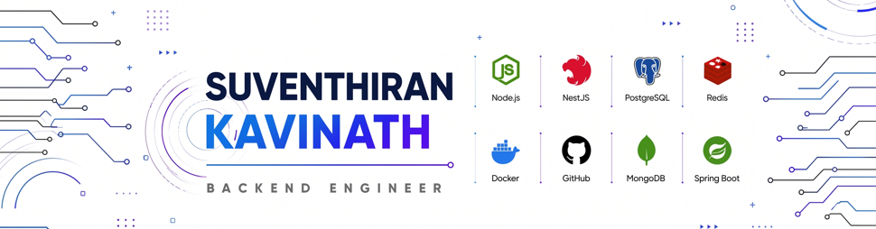

<picture>
  <source media="(prefers-color-scheme: dark)" srcset="banner-dark.svg">
  <source media="(prefers-color-scheme: light)" srcset="banner-white.svg">
  
</picture>

---

## 👨‍💻 About Me

Backend Engineer with **2+ years** of professional experience building production software from **architecture → deployment** — **10+ projects** shipped across real-time platforms, AI infrastructure, and enterprise SaaS.

Currently the **sole backend engineer** behind an industrial real-time alarm monitoring platform responsible for:

- 🚀 Backend Architecture
- ⚡ Event-Driven Systems
- 🔴 Real-Time APIs & WebSockets
- 🗄️ PostgreSQL Database Design
- 📦 Redis & BullMQ Queue Processing
- 🐳 Docker Infrastructure
- 🔄 GitHub Actions CI/CD
- ☁️ Production Deployment

- 💬 Ask me about: NestJS, Spring Boot, Node.js, PostgreSQL, Redis, Docker, real-time systems
- 📫 Reach me:

  
  
  

---

## 🛠️ Technologies & Tools

<table>
  <tr>
    <td valign="top" width="50%">
      <h6>Backend 💻</h6>
      
      
      
      
      
      
      
      
      
    </td>
    <td valign="top" width="50%">
      <h6>Database 🗃️</h6>
      
      
      
      
      
    </td>
  </tr>
  <tr>
    <td valign="top" width="50%">
      <h6>DevOps & Infra ⚙️</h6>
      
      
      
      
      
      
      
    </td>
    <td valign="top" width="50%">
      <h6>Frontend & AI 🤖</h6>
      
      
      
      
      
      
      
      
      
    </td>
  </tr>
</table>

---

## 📊 GitHub Stats

  <table>
    <tr>
      <td>
        
      </td>
      <td>
        
      </td>
    </tr>
    <tr>
      <td colspan="2">
        
      </td>
    </tr>
  </table>

### 🌱 Contribution Graph

### 🏆 GitHub Profile Trophy

  

---

## 📌 Featured Projects

> These should also be [pinned](https://docs.github.com/en/account-and-profile/setting-up-and-managing-your-github-profile/customizing-your-profile/pinning-items-to-your-profile) to your GitHub profile. Update the links once the repos exist.

| Project | Description | Stack |
|---|---|---|
| 🚨 **Centralized Alarm Monitoring System** *(NDA)* | SCADA-grade real-time monitoring platform processing **1,000+ device events/sec**. | NestJS • Redis • PostgreSQL • BullMQ • Docker |
| 🤖 **Sentinel – AI Governance Platform** | Enterprise AI governance platform with LLM Gateway, Policy Engine, RAG, and Audit Logging. | NestJS • PostgreSQL • pgvector • Redis |
| 💬 **WhatsApp Business Messaging Platform** | WhatsApp Cloud API platform with billing, queue processing, templates, and dashboard. | NestJS • Prisma • PostgreSQL • Redis |
| 🏢 **NexusERP** | Multi-tenant ERP with inventory, quotations, RBAC, reporting, and testing. | Next.js • Prisma • PostgreSQL |
| 📚 **Bundle** | Flutter + NestJS digital publishing platform available on Google Play. | Flutter • NestJS • Firebase |

---

## ⚡ Engineering Highlights

✅ Event-Driven Architecture&nbsp;&nbsp;&nbsp;✅ Clean Architecture&nbsp;&nbsp;&nbsp;✅ REST APIs&nbsp;&nbsp;&nbsp;✅ WebSockets&nbsp;&nbsp;&nbsp;✅ JWT Authentication

✅ Role-Based Access Control&nbsp;&nbsp;&nbsp;✅ Redis & BullMQ Queues&nbsp;&nbsp;&nbsp;✅ PostgreSQL Performance&nbsp;&nbsp;&nbsp;✅ Docker Deployment&nbsp;&nbsp;&nbsp;✅ GitHub Actions CI/CD&nbsp;&nbsp;&nbsp;✅ Production Infrastructure

---

## 🌱 Currently Learning

- ☁️ AWS
- ☸️ Kubernetes
- 📊 Prometheus & Grafana
- 🤖 AI Infrastructure
- 🧪 Advanced Testing

---

## ⚡ Recent Activity

<!--START_SECTION:activity-->
<!--END_SECTION:activity-->

---
<!-- 

  Built with ❤️ by <a href="https://github.com/Kh1004">Suventhiran Kavinath</a>

 -->
